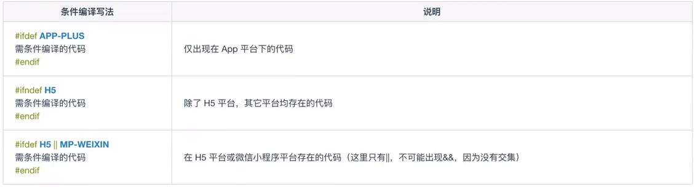

# uni-app基础

###  规范
#### 页面文件遵循Vue单文件组件规范:
```vue
<template>
    <view class="main">
        {{msg}}	
    </view>
</template>

<script>
	export default {
        data() {
            return {
				msg: 'Hello'
            }
        }
    }
</script>

<style>
    .main {
        background-color: #f5f5f5;
    }
</style>

```

#### 组件标签靠近小程序规范：

```html
<!-- 传统标签 -->
<body>
	<div>Hello</div>
	<span>Tom</span>
</body>

<!-- 组件标签 -->
<template>
	<view>Hello</view>
    <text>Tom</text>
</template>
```

#### 接口能力(JS API)靠近微信小程序规范：

```javascript
// 获取位置信息
uni.getLocation({
    type: 'wgs84',
    success: function(res) {
        console.log('当前经度：'+res.longitude);
        console.log('当前纬度：'+res.latitude);
    }
})
```

#### 数据绑定与事件处理使用Vue.js规范：

```vue
<template>
	<view @click="changeMsg">
    	{{msg}}
    </view>
</template>

<script>
	export default {
        data() {
            return {
                msg: 'Hello'
            }
        },
        methods: {
            changeMsg() {
                this.msg = 'Nice'
            }
        }
    }
</script>

<style></style>
```


### 特色

#### 条件编译



#### App端的Nvue开发

uni-app App端内置了一个基于 weex 改进的原生渲染引擎，提供了原生渲染能力。

在App端，如果使用vue页面，则使用webview渲染；如果使用nvue页面(native vue的缩写)，则使用原生渲染。

#### HTML5+

uni-app App端内置 HTML5+ 引擎，让js可以直接调用丰富的原生能力。

一些比较复制的功能，可以直接调用App原生的插件来实现

只能在App端去使用，无法在H5和小程序中使用


### 基础知识点

1. 组件：基础组件与自定义组件
2. API：网络请求等
3. 路由：页面跳转
4. 生命周期：页面显示隐藏等
5. 语法：数据绑定、事件处理等
6. 布局样式：样式引用，sass等

